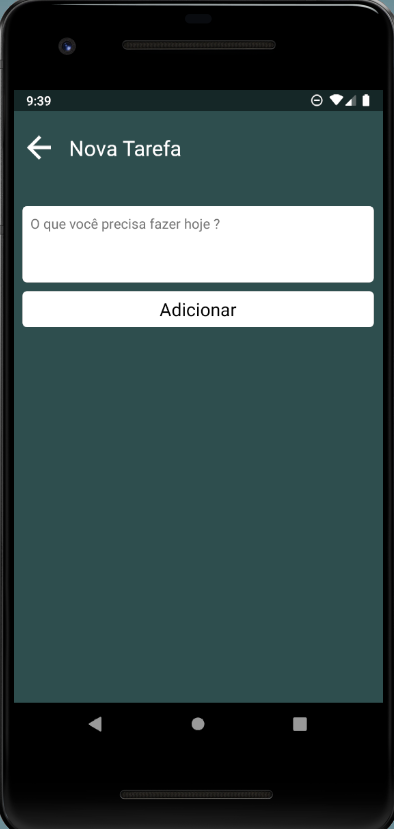

# App de Lista de Tarefas
 - Telas

  
  

---

## Descrição do Projeto  

Uma simples lista de tarefas para exercitar o conhecimento com o React Native. 

## Autor/Contato

| [ @Guilhermelima3](https://github.com/Guilhermelima3) |
| :---: |

- Linkedin  [Guilherme Lima](https://www.linkedin.com/in/guilherme-lima-marinho-242635196)
- E-mail [guilhermel_ima@hotmail.com]
---
